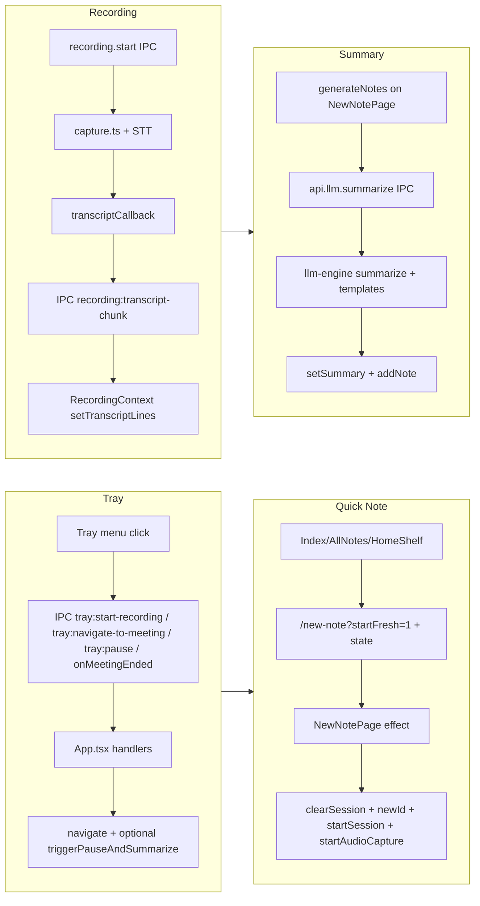

# Core end-to-end flows

This document describes the four core flows from user action to persisted outcome. Use it to reason about and debug E2E behavior.

**Flows:** [Quick Note](#1-quick-note-e2e) | [Tray](#2-tray-e2e) | [Summary](#3-summary-e2e) | [Recording](#4-recording-e2e)

---

## Flow boundaries and data flow

---

## 1. Quick Note (E2E)

Start a new note from UI or tray so the session is fresh with no carry-over from a previous note.

### Entry points

- Home empty state button
- HomeShelf "Quick Note"
- AllNotes "New note"
- Tray "New Note"
- App tray start-recording (with `startFresh=1`)

### Path

1. Navigate to `/new-note?startFresh=1` with `state: { startFresh: true }`.
2. [NewNotePage.tsx](../src/pages/NewNotePage.tsx) mount effect (lines 368–439) sees `startFresh`.
3. If previous session had content: pause → generateNotes → stopAudioCapture.
4. Then `doStartNew()`: clearSession, new UUID, setNoteId/setTitle/setSummary/setPersonalNotes, startSession(newId), navigate replace to `?session=newId`, startAudioCapture.

### Success criteria

- New note has a new ID.
- URL is `/new-note?session=<new-uuid>`.
- Timer starts from 0.
- No previous transcript or summary visible.
- Recording can start (if STT configured).

### Key files

- [src/pages/Index.tsx](../src/pages/Index.tsx) (lines 255, 317)
- [src/pages/AllNotes.tsx](../src/pages/AllNotes.tsx) (line 22)
- [src/App.tsx](../src/App.tsx) (lines 59–60)
- [src/pages/NewNotePage.tsx](../src/pages/NewNotePage.tsx) (lines 117–127, 368–439)

---

## 2. Tray (E2E)

Menu bar (tray) actions: start recording, open meeting, pause, and meeting ended.

### Entry points

- Tray icon click
- Tray menu: "New Note", "Open Meeting" / "Open Recording", "Pause Recording"
- Meeting-detector "meeting ended"
- Notification "Meeting Detected" click

### Paths

- **Start recording:** Tray "New Note" → main sends `tray:start-recording` (optionally with title) → [App.tsx](../src/App.tsx) navigates to `/new-note?startFresh=1` with startFresh state → same Quick Note flow.
- **Open meeting:** Tray click or "Open Meeting" → `tray:navigate-to-meeting` → navigate to `/new-note?session=${activeSession.noteId}` (no startFresh).
- **Pause:** "Pause Recording" → `tray:pause-recording` → renderer calls pauseAudioCapture (IPC recording:pause).
- **Meeting ended:** [meeting-detector.ts](../electron/main/meeting-detector.ts) sees app exit → main calls handler → App navigates to `/new-note?session=...` with `state: { triggerPauseAndSummarize: true }` → NewNotePage effect (lines 346–357) runs generateNotes with scratch and clears state.

### Success criteria

- Tray actions change window route and recording state as above.
- Meeting ended triggers pause + summarize and note is saved with summary.

### Key files

- [electron/main/tray.ts](../electron/main/tray.ts)
- [src/App.tsx](../src/App.tsx) (lines 49–87)
- [electron/preload/index.ts](../electron/preload/index.ts) (tray IPC)
- [src/pages/NewNotePage.tsx](../src/pages/NewNotePage.tsx) (lines 346–357)

---

## 3. Summary (E2E)

Transcript and personal notes → LLM → structured summary → save and display.

### Entry points

- User clicks Pause (with content)
- Auto-pause after silence
- LiveMeetingIndicator "Pause"
- Template rerun
- "Pause and summarize" from tray/indicator

### Path

1. [NewNotePage.tsx](../src/pages/NewNotePage.tsx) `generateNotes()` (lines 271–326) builds transcript from `transcriptRef.current`.
2. Calls `api.llm.summarize({ transcript, personalNotes, model, meetingTemplateId, customPrompt })` → IPC `llm:summarize`.
3. [llm-engine.ts](../electron/main/models/llm-engine.ts) `summarize()` → template (e.g. general) + [templates.ts](../electron/main/models/templates.ts).
4. Returns MeetingSummary → renderer setSummary(generatedSummary), addNote({ ...note, summary: generatedSummary }).

### Success criteria

- Summary appears in UI (overview, topics, action items).
- Note saved to DB/localStorage with same summary.
- Reopening note shows full template structure (discussionTopics etc.) via hydration in NewNotePage (lines 220–248).

### Key files

- [src/pages/NewNotePage.tsx](../src/pages/NewNotePage.tsx) (lines 271–326, 448–458, 491–495)
- [electron/main/ipc-handlers.ts](../electron/main/ipc-handlers.ts) (lines 173–174)
- [electron/main/models/llm-engine.ts](../electron/main/models/llm-engine.ts) (lines 202–254)
- [src/components/EditableSummary.tsx](../src/components/EditableSummary.tsx)
- [electron/main/models/templates.ts](../electron/main/models/templates.ts)

---

## 4. Recording (E2E)

Start capture → audio → STT → transcript chunks → UI and save.

### Entry points

- NewNotePage mount starts capture when session starts and `usingRealAudio`
- Resume button after pause

### Path

1. [RecordingContext.tsx](../src/contexts/RecordingContext.tsx) `startAudioCapture(sttModel)` → IPC `recording:start`.
2. [ipc-handlers.ts](../electron/main/ipc-handlers.ts) calls [capture.ts](../electron/main/audio/capture.ts) `startRecording` with callback.
3. Capture runs VAD/STT, invokes callback with `{ speaker, time, text }`.
4. IPC `recording:transcript-chunk` → preload forwards to renderer.
5. RecordingContext listener appends to transcript lines → NewNotePage (and others) read from context; on save, transcript is in note.

### Success criteria

- After start, transcript chunks appear in UI.
- Pause stops new chunks; resume restarts.
- Saved note contains transcript array.
- STT errors surface (e.g. toast or inline error).

### Key files

- [src/contexts/RecordingContext.tsx](../src/contexts/RecordingContext.tsx) (lines 219–250, transcript listener)
- [electron/main/audio/capture.ts](../electron/main/audio/capture.ts) (transcriptCallback, processBufferedAudio)
- [electron/main/ipc-handlers.ts](../electron/main/ipc-handlers.ts) (lines 146–154)
- [electron/preload/index.ts](../electron/preload/index.ts) (recording:transcript-chunk)

**Me vs Them:** Speaker labels follow **microphone vs system audio**, not names spoken in the meeting. See [transcript-me-them.md](transcript-me-them.md) for behavior and optional mic-channel debug logging.

---

## Future: E2E automation

Automated E2E tests are not yet implemented. Options for adding them:

- **Option 1 – Playwright for Electron:** Add `@playwright/test` and Playwright’s Electron support. One spec per flow: launch packaged app or dev build, drive UI (e.g. click Quick Note, wait for route/state), assert URL and visible state. Requires mocking or skipping real STT/LLM in CI (or using test keys).
- **Option 2 – IPC integration tests:** Keep Vitest; in Node, instantiate main-process handlers and a fake sender that records IPC `send` calls. Invoke `recording:start` (with mock STT), `llm:summarize` (with mock LLM), then assert callbacks and outbound events. Does not test renderer or navigation.

See [MANUAL_TEST_CHECKLIST.md](MANUAL_TEST_CHECKLIST.md) for manual verification until automation is in place.
